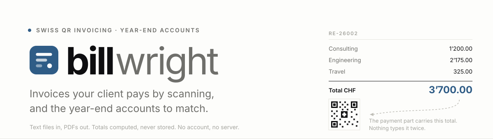
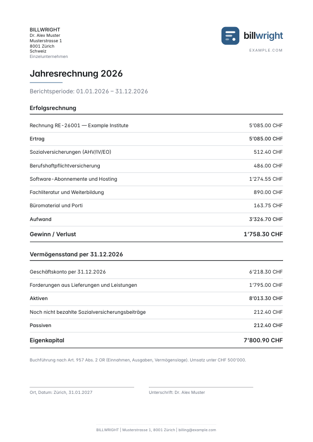
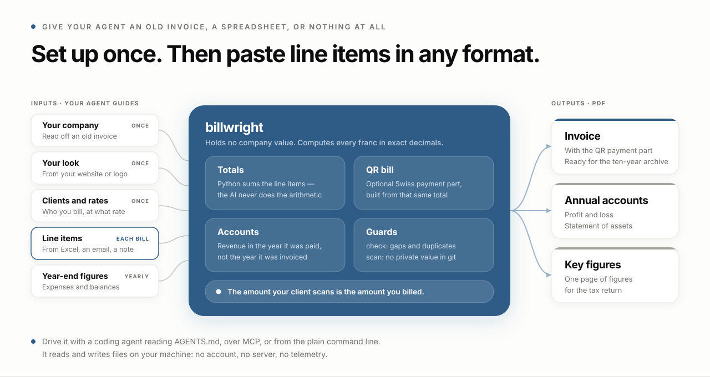
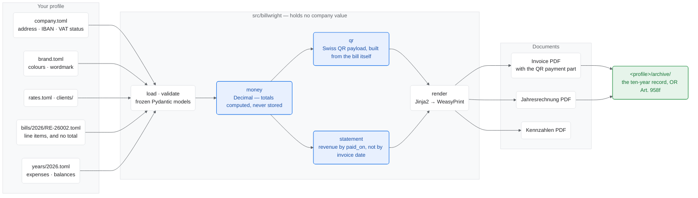

<picture>
  <source media="(prefers-color-scheme: dark)" srcset="docs/assets/banner-dark.svg">
  
</picture>

[](https://github.com/danielvogler/billwright/actions/workflows/ci.yml)
[](./LICENSE)
[](https://www.python.org/downloads/)
[](https://docs.astral.sh/uv/)
[](https://docs.astral.sh/ruff/)
[](https://mypy-lang.org/)
[](https://pre-commit.com/)

## Quick start

Open this repository in your coding agent — Claude Code, Cursor or any other —
and say:

```
Read AGENTS.md, then set up a profile for my company and issue a bill.
```

It walks you through the setup once, then turns the line items you paste into a
finished invoice.

<p align="center">
  
  
</p>

<p align="center"><em>Both of these render from a fresh clone, with no configuration.</em></p>

<picture>
  <source media="(prefers-color-scheme: dark)" srcset="docs/assets/hero-dark.svg">
  
</picture>

---

## Start here: hand it to an agent

This repository is written to be operated by a coding agent, and that is the
fastest way in. **Two steps, and no setup of your own:**

**1.** Open this repository in your coding agent — Claude Code, Cursor, or any
other.

**2.** Say this:

```
Read AGENTS.md, then set up a profile for my company and issue a bill.
```

That is the whole procedure. [`AGENTS.md`](AGENTS.md) is a file of instructions
written for exactly that request, so the agent knows what to do: it installs
whatever is missing (asking first), prints the sample invoice to check that
everything works, then sets your company up and renders your invoice.

**Bring whatever you already have.** An invoice you sent before — a PDF, a Word
file, a photo of a printout — is the ideal starting point: it has your address,
your payment details and a real line item on one page, and the agent reads them
straight off it. A letterhead, an email signature or your website work too. So
does having nothing: it will simply ask you.

**Including how it should look.** Give it your website or your logo and ask for
the invoice to match: [`skills/brand-profile`](skills/brand-profile/) tells the
agent how to derive a palette from an existing site, convert it for print, and
write it into `brand.toml` — so the document carries your colours and your
wordmark rather than the sample's. The restraint is deliberate and worth
keeping: one accent rule and a typeset wordmark, on white paper that survives
an inkjet and a scanner.

You never write a config file. The agent does that, then reads the amounts and
your IBAN back to you to confirm, because a misread digit on a payment slip is
the one mistake nobody catches in time.

**Have your IBAN to hand, and know whether you are VAT registered.** The agent
is instructed never to invent a financial value — an invented IBAN would pay a
stranger — so it will stop and ask rather than guess, and those two are what it
asks for first.

Later, at the year-end:

```
Read AGENTS.md, then produce my 2026 year-end accounts.
```

**The agent never does the arithmetic.** Every franc is calculated by the same
code that prints the invoice, in exact decimal arithmetic; the agent asks the
questions and files the answers. It is also entirely optional — there is a
normal command line underneath, and the rest of this file is how to use it
without any AI tooling at all.

### What the agent sees

Worth being plain about, because this tool handles bank details.

**Billwright itself never transmits anything.** It has no network code beyond
reading your own files, and you can verify that in an afternoon.

**A coding agent is a different program with different rules.** If you hand a
cloud-hosted agent your old invoice, that document — your address, your IBAN,
your client's name and what you charged them — is sent to whichever model that
agent uses, under that provider's terms and retention policy. That is true of
any agent doing any task; it is not special to this repository, and this
repository cannot change it.

So choose knowingly:

- **Fine with it?** Use the two-step path above. It is genuinely the fastest.
- **Not fine with it?** Do the setup by hand. It is about a dozen fields in four
  small files, described under [Setup](#setup) and
  [How it is organised](#how-it-is-organised) below, and the result is identical — the agent has no privileged path.
- **In between?** Run an agent against a local model, or set the profile up by
  hand and use an agent only for line items, which carry no bank details.

Either way, once the profile exists, issuing bills is a local command that sends
nothing anywhere.

---

## What you get

**Swiss invoices your client can pay by scanning, and the year-end accounts to
match.** Tell a coding agent about your company once. Get PDFs you can send to a
client and hand to the tax office — no subscription, no account, no server.

- **A QR bill that actually works.** The Swiss payment part is generated from
  the invoice itself, so the amount your client scans is the amount you billed.
  It cannot drift, because nothing types it twice.
- **The year-end accounts too.** Erfolgsrechnung and Vermögensstand for the tax
  office, plus a one-page figures sheet to copy into the return. Revenue comes
  from the invoices you actually got paid for, in the year you were paid.
- **Your books stay yours.** Everything lives in text files on your own machine.
  The program has no account, no server and no telemetry: it reads and writes
  files and talks to nothing. Nothing stops working when somebody's startup
  does. (If you use a coding agent to set it up, what you show *the agent* goes
  wherever that agent's model runs — see
  [What the agent sees](#what-the-agent-sees).)
- **Arithmetic you can trust.** Totals are calculated from the line items and
  never stored, so an invoice cannot disagree with itself — which the hand-made
  document this replaces did, by CHF 10.
- **It looks like your company, not like a template.** Point the agent at your
  website or an old invoice and it works out your colours, your wordmark and
  your typeface, and writes them into the profile. You are not stuck with the
  neutral default, and you do not have to name a hex code to change it.
- **The same invoice, forever.** Re-rendering a bill from three years ago
  produces the identical file, byte for byte, from the same version of
  billwright — and the PDF metadata records which version that was. That is what
  makes the archive evidence rather than a copy.

Your company details — address, bank details, clients, rates, colours — live in
a folder of small text files. The program itself holds none of them, so one
install bills for as many companies as you like.

---

## How it works

Two halves that never mix: a profile of company facts, and an engine that holds
none of them. Everything a tax inspector might question — the total, the
scanned amount, which year a franc belongs to — is derived on the way through,
not stored anywhere it could be edited into disagreeing with itself.



The arrow that matters is `money → qr`: the figure your client scans is the one
computed from the line items, so the payment part cannot disagree with the
invoice printed above it. The same applies to `statement` — revenue is summed
from bills marked paid, never typed into the accounts by hand.

---

## Setup

**Required**: Python 3.11+, [uv](https://docs.astral.sh/uv/), and WeasyPrint's
native libraries (Pango and Cairo). Without the latter you get
`cannot load library 'libgobject-2.0-0'`.

```bash
# macOS
brew install uv pango poppler

# Debian/Ubuntu
curl -LsSf https://astral.sh/uv/install.sh | sh
sudo apt install libpango-1.0-0 libpangoft2-1.0-0 poppler-utils
```

`poppler` is optional — it is only for turning a PDF into a PNG to look at.

```bash
make setup        # uv sync
```

## Try it immediately

A fresh clone renders straight away, because `example/` is a complete fictional
profile and the fallback when no other is configured:

```bash
make bill BILL=RE-26001      # renders the example company's invoice into out/
open out/*RE-26001.pdf
```

---

## Issuing a bill

```bash
make new CLIENT=<client-key>      # scaffolds the next number in the profile
$EDITOR <profile>/bills/2026/RE-26002.toml
make bill BILL=RE-26002           # renders into out/
open out/*RE-26002.pdf            # look at it
make archive BILL=RE-26002        # write the final copy into archive/
```

A bill is a small TOML file:

```toml
number = "RE-26002"
date = 2026-01-01
client = "example-institute"
terms_days = 14

[[items]]
description = "Consulting - Strategy"
quantity = 7.25
unit = "hours"
service = "consulting"        # rate looked up in rates.toml
```

There is no `total` field. The total is computed from the lines, which is the
whole point — the hand-made document this replaces stated a total its own items
did not sum to.

`out/` is scratch and gitignored. The archive is the record: Swiss law
(`OR Art. 958f`) requires keeping issued invoices for ten years.

`--archive` writes into `<profile>/archive` — beside the company data, because
that is what it is. Point it somewhere else with `--archive-dir`, with
`$BILLWRIGHT_ARCHIVE`, or once and for all in your `pyproject.toml`:

```toml
[tool.billwright]
profile = "admin/finance/billing"
archive = "admin/finance/billing/archive"   # optional; this is also the default
```

Relative paths resolve against the working directory, never against the
installed package — which is what lets the profile, and its archive, live in a
repository that merely depends on billwright.

## The yearly accounts

```bash
make statement YEAR=2026
make archive-statement YEAR=2026
```

Produces two documents:

- **`Jahresrechnung <year>.pdf`** — Erfolgsrechnung and Vermögensstand, for the
  tax office.
- **`… Kennzahlen.pdf`** — one page, one value per labelled line, for typing
  into the return.

Revenue is aggregated from the bills in the profile, so the figure the tax
office sees cannot drift from the invoices behind it. Expenses and balance
figures come from `years/<year>.toml`.

**Revenue is aggregated by `paid_on`, not by the invoice date.** Under the
receipts and payments basis (`OR Art. 957 II`) a bill issued in December and
settled in January is the *following* year's income. The example profile
demonstrates it: `RE-26002` is dated 2026-12-18, paid 2027-01-14, and appears
in the 2027 accounts while sitting in the 2026 balance as a receivable.

Two cases that are easy to state wrongly, and are stated for you:

- A year with no mandates renders as a statement of zeros **with a sentence
  saying why** — a bare table of zeros invites a follow-up question.
- A year whose invoices all went unpaid is **not** the same thing, and does not
  claim that no mandates were accepted.

## Everyday commands

```bash
make doctor                  # is the profile complete? is the IBAN valid?
uv run billwright init-profile   # write an empty profile to fill in
make list                    # every bill issued, with totals and paid status
make check-bills             # numbering gaps, duplicates, empty bills
make scan                    # fail if a tracked file holds a value from your profile
make check                   # lint + tests + the above
make help                    # every target
```

The `make` targets are thin wrappers over the CLI:

```bash
uv run billwright bill RE-26002 --archive
uv run billwright statement 2026 --language en
```

---

## Serving it over MCP

Optional, and not the way in. An agent with a terminal already has everything —
`AGENTS.md` and the command line above are the full interface, and that is the
path this repository is written for.

The case this covers is the one a shell cannot: an agent with **no terminal** —
a chat client, or something running on a schedule — that still has to issue a
bill.

```bash
uv sync --extra mcp
billwright-mcp --profile data        # stdio, launched by your MCP client
```

Eight tools, one per thing the CLI already does: `profile_info`, `list_bills`,
`show_bill`, `new_bill`, `bill`, `statement`, `check_bills`, `check_profile`.

Three things are worth knowing about it, because they are why it is safe to
have:

- **It restates nothing.** `AGENTS.md` is served verbatim as the
  `billwright://agents` resource rather than paraphrased into tool descriptions.
  A second copy of the rules would drift, and the copy the agent reads would be
  the stale one.
- **It computes nothing.** Every figure comes from the same loaders and the same
  exact-decimal arithmetic the command line uses, so a bill rendered over MCP is
  the same file as one rendered from the shell.
- **It says which company it is billing as, every time.** The profile is
  resolved once at startup and named in every response. A terminal shows you a
  working directory; a chat window shows you nothing, and billing under the
  wrong company is worse than not billing.

`archive=True` is a parameter on `bill` and `statement`, exactly as `--archive`
is a flag on the CLI. It writes the permanent ten-year copy, so it is a separate
decision from rendering a draft — and your MCP client will show you the argument
before it runs.

---

## How it is organised

```
example/          a fictional profile — committed, used by the tests and CI
data/             your profile (gitignored) — company, brand, rates, clients, bills
src/billwright/   the generator. Contains no company values at all.
  assets/fonts/   vendored Inter, shipped inside the wheel
data/archive/     issued PDFs, the ten-year record (gitignored)
skills/           agent-facing guidance for building and extending this
docs/             README images — the banner and the example renders
out/              scratch renders (gitignored)
```

The split is deliberate. `src/` is a generic Swiss billing engine; everything
specific to a company lives in its profile. Billing for another company means
copying a profile directory, changing the values, and pointing `--profile` at
it. See [skills/README.md](skills/README.md).

Which profile a run uses is resolved in this order, so a clone with no profile
of its own still renders:

```
--profile flag  >  $BILLWRIGHT_PROFILE  >  [tool.billwright] profile  >  ./data  >  ./example
```

The first two are requests and are strict: a path with no `company.toml` is an
error rather than a silent fallback, because billing under the wrong company is
worse than not billing. The rest are candidates, each used only if it actually
holds a `company.toml`.

Your profile being gitignored is a convention; `make scan` is the enforcement.
It fails if any value from your profile — or anything shaped like an IBAN, a
Swiss UID, an email address or a phone number — appears in a tracked file, and
it runs as part of `make check`.

## Changing how it looks

Colours and the wordmark are in the profile's `brand.toml`; type and spacing in
`src/billwright/styles/tokens.css`. Those are the only places such values may
exist — the templates reference CSS custom properties and never a literal.

The wordmark is typeset from `brand.toml` rather than embedded as an image, so
it stays sharp at any size. Omit the table and no wordmark is drawn.

**If tokens are not enough, the profile can override the engine.** Colours and a
wordmark make two companies' invoices siblings, not strangers — same layout,
different identity. When you want your own layout:

```
<profile>/styles/overrides.css     appended to every document
<profile>/styles/bill.css          appended to invoices only
<profile>/styles/statement.css     appended to the yearly accounts only
<profile>/templates/bill.html.j2   replaces the packaged template outright
```

Stylesheets are appended after the packaged ones, so you override by declaring;
templates are replaced by name. Nothing is forked, so you still get fixes. The
Swiss QR payment part keeps its mandated geometry regardless — that part is not
yours or ours to restyle.

One deliberate default: **the page is white**. A tinted A4 floods an inkjet and
scans badly, so the brand lives in the accent rule instead of the ground.

> **Never edit a rendered PDF.** The next build overwrites it. Edit the data;
> that is the source of truth.

---

## Scope and limits

- The payment part implements the **Swiss QR bill**, so issuers outside
  Switzerland are not supported today.
- The reference type is `NON` — the invoice number travels in the free-text
  field. Structured creditor references (`QRR`) need your bank to issue a
  reference range first.
- A VAT block exists and switches on `vat_registered` in the profile. Below the
  Swiss registration threshold it stays off and no VAT line is rendered.
- **Scan the QR code with a banking app before sending your first real bill.**
  The payload is unit-tested, but nothing substitutes for a live scan.

This produces documents. It is not tax or legal advice, and you are responsible
for what you send and file.

---

## Licence and contributing

Apache License 2.0 — see [LICENSE](LICENSE) and [NOTICE](NOTICE).

Two things carry their own terms. The Inter typeface bundled unmodified in
`src/billwright/assets/fonts/` is under the SIL Open Font License 1.1
([`OFL.txt`](src/billwright/assets/fonts/OFL.txt)). `python-stdnum`, used to
checksum IBANs, is LGPL — a dependency, not vendored here. Everything else in
the dependency tree is BSD or MIT.

Issues and pull requests are welcome. Before opening one, run `make check`: it
runs the linter, the type checker, the leak scan, the test suite, the numbering
checks and every pre-commit hook — the same set CI runs. `make hooks` installs
the hooks so that happens before a commit exists rather than after.

Two rules worth knowing before you change anything:

- **No company value may enter `src/`.** The engine is generic; everything
  specific lives in a profile directory. `make scan` enforces it.
- **Totals are computed, never stored,** and money is `Decimal` throughout.
